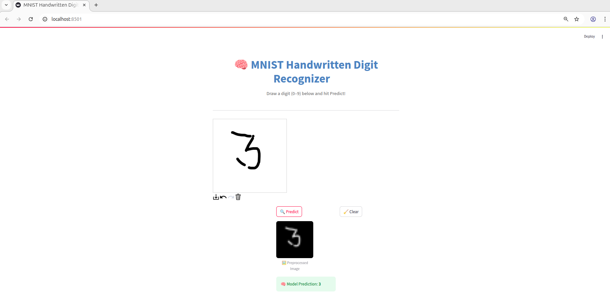

Here's a **beautified and rich version** of your README with improved formatting, emoji flair, consistent structure, clickable badges, and better visual hierarchy while keeping everything relevant:

---

<p align="center">
  
</p>

<h1 align="center">🧠 MNIST Classification with FastAPI 🚀</h1>

<p align="center">
  <a href="#"></a>
  <a href="#"></a>
  <a href="#"></a>
  <a href="#"></a>
  <a href="#"></a>
  <a href="#"></a>
</p>

---

## 📌 Project Overview

This project provides a lightweight **FastAPI** service for **loading**, **training**, and **predicting** on the classic **MNIST** dataset — all backed by **MongoDB** storage and built with a vision for **End-to-End MLOps** integration.

---

## ✨ Features

- 🗃️ **Data Storage:** Persist the MNIST dataset in MongoDB.
- 🧠 **Model Training:** Train a digit classifier directly from the API.
- 🔍 **Prediction:** Predict digits from input images and compare results visually.
- 🧪 **API Endpoints:** Swagger & Redoc documentation included.
- 📦 **Docker-Ready:** Containerize the whole stack (in progress).

---

## ⚙️ Prerequisites

Ensure you have the following installed:

- **Python**
- **MongoDB**
- **Docker** (optional, for containerization)

---

## 🚀 Getting Started

### 1. Clone the Repository

```bash
git clone https://github.com/mukul74/MNIST_Classification.git
cd MNIST_Classification
```

### 2. Set Up Virtual Environment

```bash
python -m venv venv
source venv/bin/activate      # Mac/Linux
venv\Scripts\activate         # Windows
pip install -r requirements.txt
```

### 3. Start Required Services

```bash
sudo systemctl start mongod
sudo systemctl start docker
```

✅ Verify:
```bash
systemctl status mongod
systemctl status docker
```

### 4. Run the Backend (FastAPI)

```bash
uvicorn src.main:app --reload
```

### 5. Launch the Frontend (Streamlit)

```bash
streamlit run app.py
```

---

## 📷 User Interface

<p align="center">
  
</p>

---

## 🧪 How to Use

### 1. Store the MNIST Dataset in MongoDB

```bash
curl -X 'POST' \
  'http://127.0.0.1:8001/store_mnist' \
  -H 'accept: application/json' \
  -d ''
```

### 2. Train the Model

```bash
curl -X 'POST' \
  'http://127.0.0.1:8001/train' \
  -H 'accept: application/json' \
  -d ''
```

### 3. Predict on Hand-drawn Image

Visit: [http://localhost:8501](http://localhost:8501)

---

## 🐳 Dockerizing the App *(In Progress)*

### 1. Add:

- `Dockerfile`
- `.dockerignore`
- `docker-compose.yml`

### 2. Clean Previous Builds

```bash
docker compose down -v
docker system prune -af
```

### 3. Run with Docker Compose

```bash
docker-compose up --build
```

📍 Visit: [http://127.0.0.1:8000](http://127.0.0.1:8000)

---

## 🔗 API Documentation

- 📘 **Swagger UI:** [http://127.0.0.1:8000/docs](http://127.0.0.1:8000/docs)
- 📙 **Redoc:** [http://127.0.0.1:8000/redoc](http://127.0.0.1:8000/redoc)

---

## ✅ Git & Pre-commit Setup

### 1. Install Pre-commit Hooks

```bash
pip install pre-commit
pre-commit install
```

### 2. Push to GitHub

```bash
git add .
git commit -m "Your commit message"
git push -u origin main
```

---

## 👤 Author

**Mukul Agarwal**  
[🔗 GitHub Profile](https://github.com/mukul74)

---

## 🤝 Contributing

Contributions, issues, and feature requests are welcome! Feel free to check the [issues page](https://github.com/mukul74/MNIST_Classification/issues) or submit a pull request.

---

## 📅 Upcoming Features

- ✅ Unit & integration tests using `pytest`
- 🎨 Streamlit UI improvements
- 📊 ML model tracking and data versioning

---

## 📄 License

This project is licensed under the [MIT License](LICENSE).

---

Let me know if you'd like a version with collapsible sections or if you want a Markdown file generated directly!